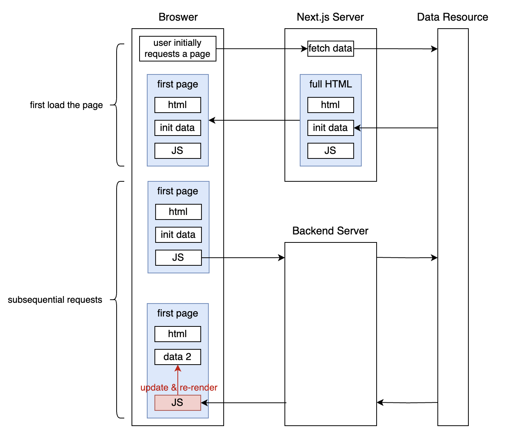
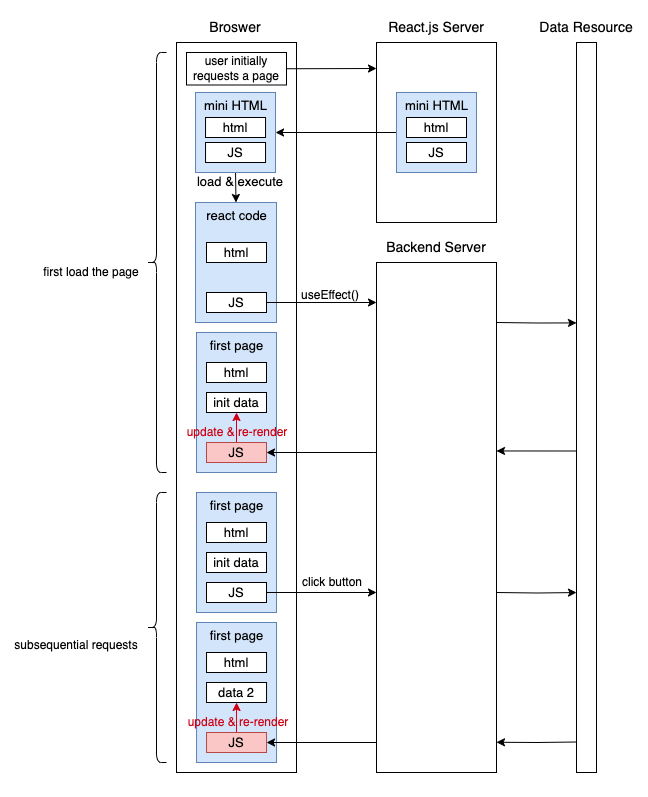

# Overview
To truly grasp the essence of Next.js, one must first understand the interplay between HTML and JavaScript in the web's architecture. Web pages consist of HTML, CSS, and JavaScript. HTML can be seen as the structural foundation of the project, while JavaScript dynamically generates additional HTML snippets to enhance the original HTML skeleton based on user actions or other events. Furthermore, it's crucial to comprehend [the rendering process](https://github.com/liushuyu6666/Knowledge/blob/master/Web_Application/Readme.md#rendering).

`Next.js` is closely integrated with `React.js`. Upon the initial page load, `Next.js` pre-renders the content, delivering a complete HTML page accompanied by a JavaScript bundle (which includes the `React.js` code). As for subsequent interactions or requests, it's `React.js` that steps in. React fetches the necessary data, making necessary updates to the web page on the fly. Thus, the `Next.js` application still consists of multiple React.js components. The key distinction is that, unlike standalone `React.js` applications, the initial data fetching isn't initiated by the `useEffect()` function. However, once fetched, this data might still be managed using React's state mechanisms."

`Next.js` can be better understood when contrasted with the mechanisms of `React.js`:
</img>
</img>

# Pre-rendering
An integral feature of `Next.js` is "Pre-rendering". Upon an initial browser request to a `Next.js` server, the framework pre-renders the content by fetching necessary data from relevant sources. This server then compiles this data with HTML and requisite JavaScript (including React.js code for subsequent interactions) to produce the pre-rendered page. Consequently, the browser receives a full HTML page complemented by a minimal set of JavaScript, enabling it to immediately display the content without waiting for initial data responses.

Importantly, along with the HTML, React.js code is transmitted. As the browser processes this code, React initiates a process known as **hydration**. This phase ensures React's virtual DOM aligns with the existing page's real DOM. Upon successful hydration, React assumes control of the page, managing subsequent user interactions, such as button clicks or form submissions.

We can check the pre-rendering by disabling JavaScript in the browser. You will see the Next.js app is still rendered without JavaScript, but [This pure React.js page](https://create-react-template.vercel.app/) cannot be displayed.

## Hydration
When the JavaScript code runs in the browser, React "hydrates" the already-rendered content. "Hydration" means that React attaches event listeners and state management to the existing DOM produced by the server-side rendered HTML. Instead of recreating the entire DOM, React uses its virtual DOM to understand the structure and state of the already-present real DOM. Because the structures are the same (since the server used the same React code to generate the HTML), React can attach event listeners without re-rendering the content.

Once hydration is complete, the app behaves as a typical React SPA. Any updates or state changes trigger React's diffing algorithm against the virtual DOM, and only the necessary real DOM updates occur.

## Pre-rendering Types
Pre-rendering methods includes:
1. **Server-Side Rendering (SSR)**: 
   1. Implemented using the `getServerSideProps` method in Next.js.
   2. The page is pre-rendered for each request, ensuring the most up-to-date content.
   3. This approach is triggered by:
      1. initially requesting a page,
      2. refreshing the page,
      3. Navigating to a new page (within the same `Next.js` app): This might not always trigger server-side rendering. When you navigate between pages within a `Next.js` application using its `<Link>` component, the navigation occurs client-side, taking advantage of `React.js`'s capabilities to only update the changed parts of the page. This client-side navigation fetches the new page's content (and runs any data-fetching code in the page's components) but doesn't do a full server-side render. However, if you navigate to a new page that is specifically set up to always require SSR, or if you navigate using a full page load (like if you manually change the URL or use a standard anchor tag), then it would trigger SSR.
2. **Static Generation**:
   1. Implemented using the `getStaticProps` method in Next.js.
   2. Pages are pre-rendered at build time, meaning there's no need to fetch new data post-build.
   3. Once generated, the static page can be cached by a Content Delivery Network (CDN) for faster delivery.
3. **Incremental Static Regeneration**:
   1. An optimal blend of the two aforementioned methods.
   2. Initially, pages are pre-rendered at build time similar to static generation. However, a revalidation interval is set, post which the page is re-rendered.
   3. Following each re-rendering interval, users are presented with an updated version, which then gets cached until the subsequent interval.

Note: For any individual page in Next.js, you can't employ both static generation and server-side rendering (SSR) concurrently.

# Data Fetch
Next.js provides multiple methods for data fetching. We can categorize them into two methods roughly. Pre-rendering methods and Client-side methods.

1. pre-rendering methods: (already introduced)
   1. Static Generation
   2. Server-side Rendering
   3. Incremental Static Regeneration
2. client-side methods:
   1. Client-side Data Fetching:
   2. API Routes:

For client-side data fetching, React sends a request directly from the browser to a separate backend server. Upon receiving the JSON response, the React components update accordingly. API Routes, on the other hand, work similarly but with a key difference: the request is directed to the `Next.js` server itself, rather than an external backend server. Or, in other words, the Next.js server plays the role of a backend server in the API Routes method.


# Structure of the whole projects

The structure of the next.js project:
```text
<root>
  |
  |--- components
  |
  |--- public
  |
  |--- styles
  |
  |--- pages
         |
         |--- _app.js
         |
         |--- index.js
         |
         |--- posts
                |
                |--- [id].js
```

## `components` folder
Keep components here.

## `public` folder
For static assets.

## `styles` folder
To store global CSS files. Next.js project also has component-level CSS in each component folder.
1. `globals.css`: You can add global CSS files by importing them from `pages/_app.js` (create one if you don't have it). You cannot import global CSS anywhere else. The reason that global CSS can't be imported outside of `pages/_app.js` is that global CSS affects all elements on the page.

## `pages` folder

### `_app.js`
1. The default export of `_app.js` is a top-level React component that wraps all the pages in your application.
   1. Go to `pages/_app.js` to see how to use.
2. You can use this component to keep state when navigating between pages,
3. or to add global styles.
4. You need to restart the development server when you add `pages/_app.js`.

# Build-in Component
## Link
To link to anther page by clicking.  

Go to `pages/index.js` to check the code.

# CSS Modules

The [official documentation is here](https://nextjs.org/docs/pages/building-your-application/styling/css-modules).

1. CSS Modules are extracted from the JavaScript bundles at build time and generate .css files that are loaded automatically by Next.js.
2. CSS module allows you to scope CSS at the component-level, you can create a `.css` file in each component folder to make the whole structure organized.
   1. Go to `components/layout.js` to see how to use CSS in a component level.
3. A unique class name will be generated automatically for avoiding a class name collisions.
4. Next.js’s code splitting feature works on CSS Modules as well. It ensures the minimal amount of CSS is loaded for each page.

# Page Routes
There are two kinds of Routes in the Next.js. one is 

## Dynamic Routes
Since the pages folder determines the routes, if we want to have the path `/posts/<id>`, we need to utilize dynamic routes. Hence, we must create a `pages/posts/[id].js` file. Pages that begin with `[` and end with `]` signify dynamic routes in Next.js.

There components must be contained in the dynamic routes:
1. `getStaticPaths` to list all possible values for `id`.
2. `getStaticProps` to take `id` and fetch necessary data based on `id` and return the value wrapped in the `props`.
3. A React component to get the values from `props` and render them.

To list all possible values for `id`, we need to use the `getStaticPaths` function in the file `pages/posts/[id].js`. The return value must be in this format:
```javascript
return {
    paths: [ // must contain paths
        { // object's array
            params: { // must contain params key
                // Values in the params can be customized
                id: 'what-you-want',
            },
        },
        {
            params: { // must contain params key
                id: 'whatever',
            }
        }
    ],
    fallback: true
}
```

Additionally, the filename `id` (a.k.a path variable) will be passed to the `getStaticProps` function. Therefore, you can access the value of `id` within the `getStaticProps` function. Wrap `postData` into `props` and return it.

The component `Post` could take `postData` and render it.

Refer to `pages/posts/[id].js` to review the code.

# API Routes
API routes in Next.js are not counted as part of the regular page routes. API routes are a separate concept that allows you to create serverless API endpoints within your Next.js application.

Define API Routes under the folder `pages/api`.


# Libraries / Dependencies

## In this project
1. `gray-matter`: convert markdown files into `.json` format.
2. `remark` & `remark-html`: render Markdown.


## More Libraries

There are some additional libraries to use:
1. `clsx`
2. `postcss`
3. `tailwindcss`
4. `autoprefixer`
5. `sass`

