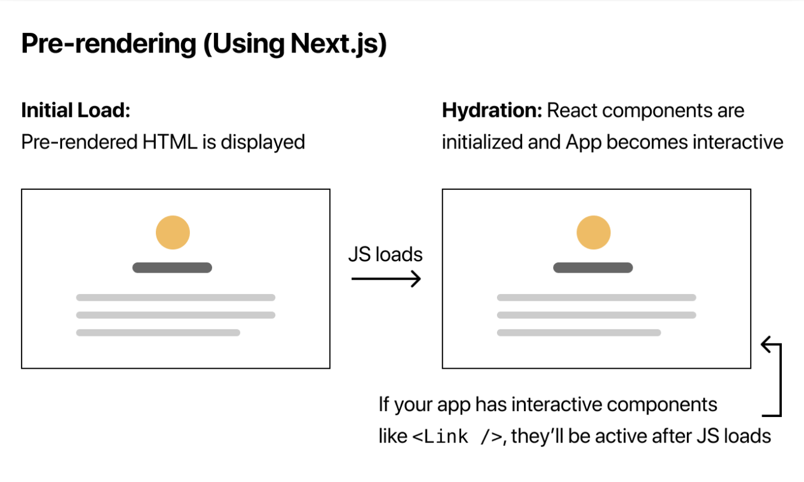
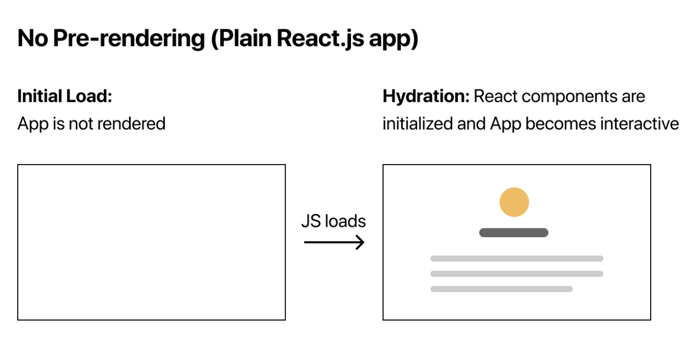
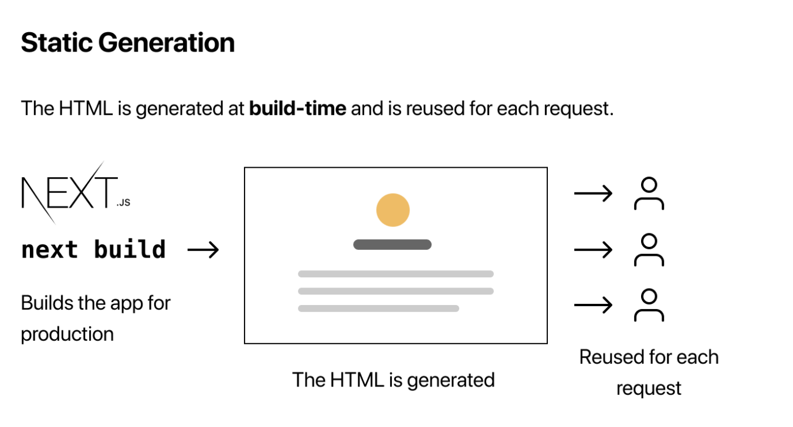
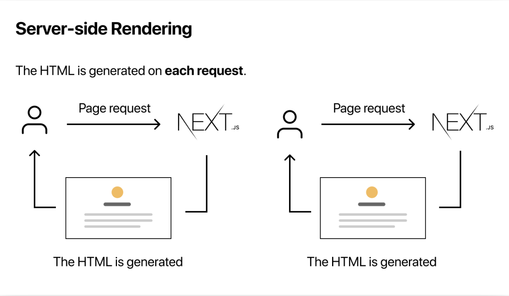

# Overview
In Next.js, there are two main components: the server and the client. To understand how Next.js works, let's consider some key concepts. Web pages consist of HTML, CSS, and JavaScript. HTML can be seen as the structural foundation of the project, while JavaScript dynamically generates additional HTML snippets to enhance the original HTML skeleton based on user actions or other events. HTML and CSS are relatively straightforward for the browser to execute, while JavaScript may require more processing time.

The server-client model in Next.js operates on the principle of minimizing JavaScript execution on the client side. The **server** strives to convert as much JavaScript code, along with fetched data, into pre-rendered HTML code. This pre-rendered HTML is then sent to the browser, eliminating the need for the browser to perform additional rendering. This approach optimizes performance and reduces the burden on the client.

On the other hand, the **client-side** code in Next.js is responsible for sending JavaScript code to the browser. This JavaScript code enables the rendering of interactive components, which can respond to user interactions and events.

Due to the pre-rendering process in Next.js, deploying a Next.js project to S3 as a pure React.js project is not feasible. However, this does not imply that we must deploy the server and client components separately. Instead, we have alternative options such as deploying the entire project on AWS Elastic Beanstalk or Vercel, both of which can effectively handle the combined server and client components.

# Structure of the whole projects

The structure of the next.js project:
<root>
  |
  |--- components
  |
  |--- public
  |
  |--- styles
  |
  |--- pages
         |
         |--- _app.js

## `components` folder
Keep components here.

## `public` folder
For static assets.

## `styles` folder
To store global CSS files. Next.js project also has component-level CSS in each component folder.
1. `globals.css`: You can add global CSS files by importing them from `pages/_app.js` (create one if you don't have it). You cannot import global CSS anywhere else. The reason that global CSS can't be imported outside of `pages/_app.js` is that global CSS affects all elements on the page.

## `pages` folder

### `_app.js`
1. The default export of `_app.js` is a top-level React component that wraps all the pages in your application.
   1. Go to `pages/_app.js` to see how to use.
2. You can use this component to keep state when navigating between pages,
3. or to add global styles.
4. You need to restart the development server when you add `pages/_app.js`.

# Features

## [CSS Modules](https://nextjs.org/docs/pages/building-your-application/styling/css-modules)
1. CSS Modules are extracted from the JavaScript bundles at build time and generate .css files that are loaded automatically by Next.js.
2. CSS module allows you to scope CSS at the component-level, you can create a `.css` file in each component folder to make the whole structure organized.
   1. Go to `components/layout.js` to see how to use CSS in a component level.
3. A unique class name will be generated automatically for avoiding a class name collisions.
4. Next.js’s code splitting feature works on CSS Modules as well. It ensures the minimal amount of CSS is loaded for each page.

## Pre-rendering
By default, Next.js pre-renders every page. This means that Next.js generates HTML with minimal JavaScript code for each page in advance, instead of having it all done. Only When a page is loaded by the browser, its JavaScript code runs and makes the page fully interactive. (This process is called **hydration**.)

</img>
</img>

Pre-rendering can result in better performance and SEO.  

We can check the pre-rendering by disabling JavaScript in the browser. You will see the Next.js app is still rendered without JavaScript, but [This pure React.js page](https://create-react-template.vercel.app/) cannot be displayed.

The are two forms for pre-rendering: static generation and Server-side rendering.

### Static Generation
Static Generation is the pre-rendering method that generates the HTML at build time. The pre-rendered HTML is then reused on each request.
</img>

In development mode (when you run `npm run dev` or `yarn dev`), pages are pre-rendered on every request. This also applies to Static Generation to make it easier to develop. When going to production, Static Generation will happen once, at build time, and not on every request.

We recommend using Static Generation (with and without data) whenever possible because your page can be built once and served by CDN

### Server-side
Server-side Rendering is the pre-rendering method that generates the HTML on each request.
</img>

## [Fetch data](https://nextjs.org/docs/pages/building-your-application/data-fetching)

### `getStaticProps()`
It is used in a Static Generation form. The function is executed at build time ahead of a user's request. Return the data in props and the data can be used as a prop. Go to `pages/index.js` to see how to use. 

Since `getStaticProps()` executes entirely on the server-side, it doesn't send any JavaScript code to the browser. Instead, it prepares the data, renders it, and then sends the resulting HTML to the browser. This unique behavior allows you to write code directly within `getStaticProps()`, such as database queries, without worrying about exposing sensitive logic or data to the client-side.

1. In development (`npm run dev` or `yarn dev`), `getStaticProps` runs on every request.
2. In production, `getStaticProps` runs at build time. However, this behavior can be enhanced using the fallback key returned by `getStaticPaths`

### `getServerSideProps()`
It provides a server-side rendering.

### `useSWR`
To fetch data on client side.

# Libraries / Dependencies

## In this project
1. gray-matter: convert markdown files into `.json` format.

## More Libraries

There are some additional libraries to use:
1. `clsx`
2. `postcss`
3. `tailwindcss`
4. `autoprefixer`
5. `sass`

